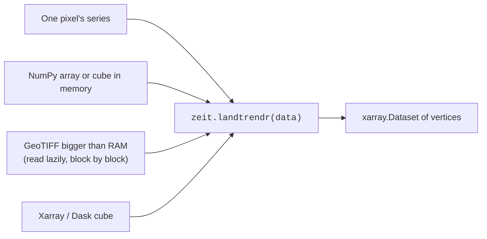

# Core Concepts

<p class="lead">A few conventions run through the whole library. Learn them once and every tutorial and API page will read the same way. If something in Zeit surprises you, the answer is most likely on this page.</p>

## Images become time series

A satellite revisits the same place again and again. Stack the images of one area in date order and you get a **data cube** with three axes: time, rows and columns. Now read the cube along its time axis at a single pixel, and you have that pixel's **time series**: how its reflectance (or a vegetation index such as NDVI) evolved.

<figure markdown>
  
  <figcaption>Real Landsat NDVI over Rondônia, Brazil. The circled pixel stays at about 0.8 while it is forest, then drops to 0.3–0.5 after being cleared in 2003. <em>Data: annual Landsat NDVI composites exported from <a href="https://github.com/eMapR/LT-GEE">LT-GEE</a> on Google Earth Engine.</em></figcaption>
</figure>

Nearly every algorithm in Zeit works **one pixel at a time**. It reads a pixel's time series, fits a model to it, and returns a few numbers (a break date, a trend slope, a class). Run over every pixel, those numbers become maps. Because pixels are independent, the work splits cleanly across CPU cores and across machines.

## Array shapes

| What | Shape | Notes |
| :--- | :--- | :--- |
| A single pixel | `(time,)` | 1-D NumPy array or list. |
| A single-band cube | **`(time, rows, cols)`** | The default input for almost everything. `zeit.load_raster` reads a GeoTIFF with one band per date into this shape, with the dates in a `time` coordinate and the georeferencing in `.rio`. |
| A multi-band cube | `(time, band, rows, cols)` | What `build_time_series` returns (as an xarray `DataArray`). CCDC's array API uses `(band, time, rows, cols)`, see its tutorial. |
| Per-pixel results | `(metric, rows, cols)` | Several outputs stacked on a first axis. The xarray accessors label it with a `metric` coordinate, so you can write `result.sel(metric="slope")`. |

!!! warning "Two exceptions"
    `zeit.twdtw.classify_twdtw` expects `(rows, cols, time)` with time **last**, and the deep-learning models follow PyTorch conventions (for example `(batch, channels, time)` for TempCNN). Their pages say so explicitly.

## Dates: each family has its own convention

This is the single most common source of confusion, because each algorithm keeps the time convention of the software it was ported from:

| Algorithm | What you pass | Example |
| :--- | :--- | :--- |
| LandTrendr | Nothing for a cube with dates (read from its `time` coordinate); integer **years** for a numpy array or a single series | `years=np.arange(1985, 2025)` |
| CCDC, Tmask | **Python ordinal days** (`date.toordinal()`) | `date(2020, 7, 1).toordinal()` → `737607` |
| BFAST, BFAST Monitor, BFAST Lite | A **regular series**: `start_time` (fractional year) and `frequency` (observations per year). No per-date array. | `start_time=2010.0, frequency=23` for 16-day composites |
| Mann-Kendall | Nothing. The slope is per **time step**, so use one value per year for a per-year slope (or `method="seasonal"`). | |
| Phenology | **Days since 1 January of `base_year`** | `doy + (year - base_year) * 365` |
| TWDTW | Any **consistent day count**, for example day of year | `[1, 17, 33, ...]` |
| SNIC, SOM | Nothing. Time is just another feature. | |

Converting from pandas / xarray timestamps:

```python
import pandas as pd

t = pd.to_datetime(cube.time.values)

years    = t.year.values                                   # LandTrendr (numpy input)
ordinals = [d.toordinal() for d in t.date]                 # CCDC, Tmask
base     = t.year.min()
days     = t.dayofyear.values + (t.year.values - base) * 365   # Phenology
```

## Values and scale factors

Most surface-reflectance and index products are stored as integers scaled by **10,000** (so NDVI 0.73 is stored as 7300). Zeit keeps each reference algorithm's own assumptions:

- **CCDC and Tmask expect reflectance × 10,000.** Their thresholds (the lasso penalty, the cloud tests) are defined on that scale. Pass 0–1 floats and results will be wrong. Tmask has a `scale_factor` argument if your data is already 0–1.
- **LandTrendr** works on any scale, but `min_magnitude` in `extract_events` is in the same units as your data (`1500` for NDVI × 10,000, `0.15` for plain NDVI).
- **Trend, BFAST and phenology** work on any scale. Slopes and magnitudes come back in the units you put in.

## Missing data

- Use **`NaN`** for missing observations in float arrays. Most algorithms skip NaNs per pixel.
- `zeit.landtrendr` also leaves out the raster's **NoData** value and, for integer data without one, **`0`** (how Earth Engine exports masked pixels). Set `nodata=` to another value, or `nodata=None` to treat only NaN as missing.
- CCDC uses its own **QA codes** (Fmask convention: `0` clear, `1` water, `2` shadow, `3` snow, `4` cloud, `255` fill). See [CCDC](../tutorials/ccdc.md#2-build-the-qa-codes).

## Ways to call an algorithm

LandTrendr has a single entry point for every form of data. `zeit.landtrendr` reads what it is given and returns the same `xarray.Dataset` of vertices, georeferenced when the input is:



| Data | Use it when | Example |
| :--- | :--- | :--- |
| **One pixel** | Exploring, plotting, testing parameters on a few series | `zeit.landtrendr(values, years=years)` |
| **Array or cube** | The data fits in memory | `zeit.landtrendr(cube)` |
| **Raster file** | A GeoTIFF too big for memory. It is read and computed in blocks. | `zeit.landtrendr("stack.tif", chunks="auto")` |
| **Dask cube** | Lazy cubes (STAC, Zarr), clusters, cloud storage | `zeit.landtrendr(cube)` or `cube.zeit.landtrendr()` |
| **CLI** | Scripts, cron jobs and HPC schedulers, no Python needed | `zeit landtrendr ...` |

The other algorithms are exposed at several levels, which all run the same C++ code: a pixel function (`zeit.ccdc.run_ccdc`), an in-memory array (`zeit.run_ccdc_array`), a GeoTIFF on disk read and written in blocks (`zeit.run_ccdc_image`), the xarray accessor for Dask cubes (`cube.zeit.run_ccdc(...)`) and the CLI (`zeit ccdc ...`). Pick the one that matches the size and form of your data.

The accessor becomes available on every xarray object once you `import zeit`. See the [Xarray accessor reference](../api/xarray.md) for the full list of methods.

## Parallelism

- **`n_jobs`** controls C++ threads (OpenMP). The default `-1` uses all cores **but one**, so your machine stays responsive. `n_jobs=1` runs single-threaded, which is handy for debugging.
- **Dask** splits a cube into spatial chunks and processes them in parallel, on one machine or a cluster. Always keep the **time axis in a single chunk** (`chunks={"time": -1, "y": 512, "x": 512}`), because each pixel needs its whole history.
- When Dask already runs one task per core, set `n_jobs=1` inside each task to avoid oversubscribing the CPU.
- On macOS, the pre-built wheels run the C++ core single-threaded. Dask parallelism still works. See [Installation](installation.md#enabling-openmp-on-macos-apple-silicon-intel) to enable OpenMP.

More in [Parallel & Cloud Processing](../tutorials/parallel-cloud-processing.md).

## Faithful ports, validated

Each algorithm is a port of a specific reference implementation (the original IDL LandTrendr, the MATLAB CCDC, R's `bfast`, `phenofit`, `sits` and so on). Parameters keep their original names and defaults where possible, so published parameter choices carry over. The [Benchmarks](../benchmarks/index.md) section documents how each port was compared with its reference, and where it differs on purpose.
