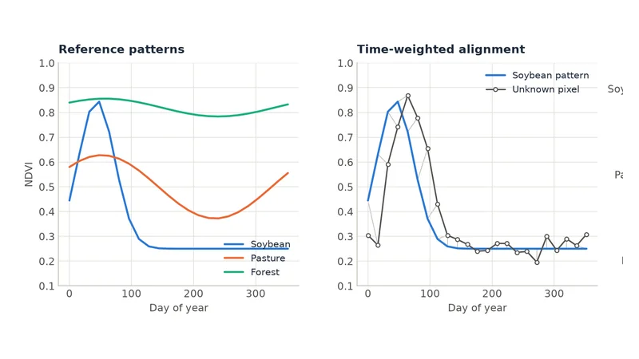

<div class="zeit-hero" markdown>

<div markdown>


<h1>Find <span>when</span> and <span>where</span> the landscape changed.</h1>

<p class="lead">Zeit is an ultra-fast Python library for analysing satellite image time series. Reference algorithms such as LandTrendr, CCDC and BFAST are re-engineered in parallel C++ and validated against their original implementations. Use them to detect deforestation, fires, regrowth, crop cycles and long-term trends. Full scenes run on a laptop using every core, and the same code scales out in parallel to your own cluster or the cloud with Dask.</p>

[Get started](getting-started/quickstart.md){ .md-button .md-button--primary }
[See what it can do](#what-you-can-do-with-zeit){ .md-button }
[:fontawesome-brands-github: GitHub](https://github.com/sacridini/zeit-cdts){ .md-button }

<div class="zeit-hero__install" markdown>

```bash
pip install zeit-cdts
```

</div>

</div>

<figure class="zeit-hero__figure" markdown>
  
  <figcaption>40 years of Landsat NDVI (1985–2024) over Rondônia, Brazil. Each colored pixel shows the year of its largest abrupt vegetation loss found by <a href="tutorials/landtrendr/">LandTrendr</a>: a drop of at least 0.2 NDVI, clearly above the pixel's noise. The map shows one event per pixel, not every loss since 1985, and gray is not always intact forest: clearings where NDVI fell slowly or stayed high as pasture are often left out. The run covered 2.8 million pixels and took about 5 seconds on a desktop CPU. <em>Data: annual Landsat NDVI composites exported from <a href="https://github.com/eMapR/LT-GEE">LT-GEE</a> on Google Earth Engine.</em></figcaption>
</figure>

</div>

## What is Zeit?

Every satellite pixel has a history. Stack images of the same place over time and each pixel becomes a **time series**: a line that stays flat while a forest stands, drops when it is cleared, and climbs back as it regrows. Most land-change questions come down to reading those lines. Did something change? When? How much? Was it sudden or gradual?

<figure markdown>
  
  <figcaption>The circled pixel was forest until 2002, then was cleared. Seen as a time series, the event is obvious. Zeit finds events like this in every pixel of an image. <em>Data: annual Landsat NDVI composites exported from <a href="https://github.com/eMapR/LT-GEE">LT-GEE</a> on Google Earth Engine.</em></figcaption>
</figure>

Zeit gives you the standard scientific methods for reading these time series, plus the plumbing around them. It can pull imagery from cloud catalogs, mask clouds, fill gaps, run the analysis in parallel, and write maps back out as GeoTIFF or Zarr.

<span class="kicker">Gallery</span>

## What you can do with Zeit

Every image below was produced by Zeit itself. Click one to open its tutorial.

<div class="gallery" markdown>

<a class="tile" href="tutorials/landtrendr/">
  
  <span class="tile-body"><span class="tile-kicker">Change detection</span><span class="tile-title">Map forest loss and regrowth</span><span class="tile-text">LandTrendr turns yearly images into maps of when, how much and how fast change happened.</span></span>
</a>

<a class="tile" href="tutorials/ccdc/">
  
  <span class="tile-body"><span class="tile-kicker">Change detection</span><span class="tile-title">Detect change in dense time series</span><span class="tile-text">CCDC models each pixel's seasonal cycle and flags the moment it breaks.</span></span>
</a>

<a class="tile" href="tutorials/bfast_monitor/">
  
  <span class="tile-body"><span class="tile-kicker">Monitoring</span><span class="tile-title">Raise near-real-time alerts</span><span class="tile-text">BFAST Monitor tests each new image against a stable history.</span></span>
</a>

<a class="tile" href="tutorials/mann_kendall/">
  
  <span class="tile-body"><span class="tile-kicker">Trends</span><span class="tile-title">Map greening and browning</span><span class="tile-text">Mann-Kendall and Theil-Sen give a robust, significance-tested trend per pixel.</span></span>
</a>

<a class="tile" href="tutorials/phenology/">
  
  <span class="tile-body"><span class="tile-kicker">Phenology</span><span class="tile-title">Extract crop and vegetation calendars</span><span class="tile-text">Start, peak and end of season, plus 16 more metrics, for every year.</span></span>
</a>

<a class="tile" href="tutorials/twdtw/">
  
  <span class="tile-body"><span class="tile-kicker">Classification</span><span class="tile-title">Classify by temporal signature</span><span class="tile-text">TWDTW matches each pixel to reference patterns, even when seasons shift.</span></span>
</a>

<a class="tile" href="tutorials/snic/">
  
  <span class="tile-body"><span class="tile-kicker">Segmentation</span><span class="tile-title">Group pixels into objects</span><span class="tile-text">SNIC superpixels group pixels whose whole trajectories are similar.</span></span>
</a>

<a class="tile" href="tutorials/som/">
  
  <span class="tile-body"><span class="tile-kicker">Clustering</span><span class="tile-title">Discover patterns without labels</span><span class="tile-text">Self-organizing maps (a bit-exact, much faster port of <code>minisom</code>) cluster millions of trajectories into a few prototypes.</span></span>
</a>

<a class="tile" href="tutorials/tempcnn/">
  
  <span class="tile-body"><span class="tile-kicker">Deep learning</span><span class="tile-title">Train land-cover classifiers</span><span class="tile-text">PyTorch models (TempCNN, LightTAE, U-TAE) that are weight-compatible with R <code>sits</code>.</span></span>
</a>

</div>

<span class="kicker">Workflow</span>

## How a Zeit analysis fits together

<div class="steps" markdown>

<div markdown>
**Get the data**

Stream a cube from a STAC catalog, Earth Engine or local GeoTIFFs.

`build_time_series` · `download_gee_timeseries`
</div>

<div markdown>
**Clean it**

Mask clouds, composite to a regular time step, smooth noise.

`apply_tmask_stack` · `regularize_time_series`
</div>

<div markdown>
**Analyse every pixel**

Run change detection, trends, phenology or a classifier.

`landtrendr` · `ccdc`
</div>

<div markdown>
**Map the result**

Turn per-pixel output into maps and write GeoTIFF or Zarr.

`extract_events` · `save_raster`
</div>

</div>

The same analysis in three styles. Pick the one that fits your data:

=== "Raster file"

    ```python
    import zeit

    ndvi = zeit.load_raster("ndvi_1985_2024.tif", start_year=1985)   # (time, y, x), georeferenced

    lt = zeit.landtrendr(ndvi)                            # looks for NDVI drops (direction="loss")
    loss = zeit.extract_events(lt, min_magnitude=2000)    # greatest loss per pixel

    zeit.save_raster(loss, "lt_results")                  # one GeoTIFF per map: yod.tif, magnitude.tif, ...
    ```

=== "Xarray / Dask cube"

    ```python
    import zeit  # registers the .zeit accessor on xarray objects

    cube = zeit.build_time_series(
        source="earth_search", collection="sentinel-2-l2a",
        bbox=[-63.2, -10.2, -63.0, -10.0],
        start_date="2019-01-01", end_date="2024-12-31",
        bands=["red", "nir"], apply_cloud_mask=True,
    )
    ndvi = (cube.sel(band="nir") - cube.sel(band="red")) / (cube.sel(band="nir") + cube.sel(band="red"))
    ndvi_16d = zeit.regularize_time_series(ndvi, freq="16D", method="median")

    trend = ndvi_16d.zeit.run_mann_kendall(method="seasonal", period=23)
    trend.zeit.to_zarr_optimized("ndvi_trend.zarr")   # computed chunk by chunk, in parallel
    ```

=== "Command line"

    ```bash
    # No Python needed: every core algorithm is also a CLI subcommand.
    zeit landtrendr ndvi_1985_2024.tif results/ --start-year 1985 --event-type loss --min-mag 2000
    zeit mmu-filter results/lt_event_yod.tif results/lt_event_yod_clean.tif --mmu-pixels 11
    ```

<span class="kicker">Why Zeit</span>

## Built for trustworthy results at scale

<div class="stats" markdown>
<div><span class="n">100%</span><span class="l">vertex-for-vertex agreement with the original LandTrendr IDL code, and model-for-model with CCDC MATLAB</span></div>
<div><span class="n">168×</span><span class="l">faster than the reference LandTrendr on one core, with more from OpenMP threads</span></div>
<div><span class="n">20×</span><span class="l">higher throughput than Google Earth Engine on a full Landsat tile, with no queue</span></div>
<div><span class="n">0</span><span class="l">compilers needed. Pre-built wheels for Windows, macOS and Linux</span></div>
</div>

<div class="grid cards two" markdown>

-   :material-scale-balance:{ .lg .middle } **Faithful to the originals**

    ---

    Each algorithm is ported from its reference implementation (IDL, MATLAB, R) and tested against it. You get the published method, not an approximation.

    [:octicons-arrow-right-24: Fidelity reports](benchmarks/fidelity.md)

-   :material-lightning-bolt:{ .lg .middle } **Fast by default**

    ---

    The per-pixel work runs in C++ (Eigen + OpenMP), outside the Python GIL. A laptop can process scenes that used to need a cloud platform.

    [:octicons-arrow-right-24: Performance](benchmarks/performance.md)

-   :material-server-network:{ .lg .middle } **Scales without rewrites**

    ---

    The `.zeit` xarray accessor maps every algorithm over Dask chunks, so the same script runs on one machine or a cluster.

    [:octicons-arrow-right-24: Scaling up](tutorials/parallel-cloud-processing.md)

-   :material-puzzle-outline:{ .lg .middle } **One toolbox, end to end**

    ---

    Data access, cloud masking, smoothing, change detection, trends, phenology, segmentation and deep learning all use the same array conventions.

    [:octicons-arrow-right-24: API reference](api/index.md)

</div>

## Where to go next

<div class="grid cards two" markdown>

-   :material-rocket-launch-outline:{ .lg .middle } **New to Zeit?**

    ---

    Install it and produce your first change map in five minutes, then learn the few concepts every tutorial builds on.

    [:octicons-arrow-right-24: Quickstart](getting-started/quickstart.md) · [Core concepts](getting-started/concepts.md)

-   :material-map-search-outline:{ .lg .middle } **Not sure which method to use?**

    ---

    A short guide that maps common questions ("when was this cleared?", "is it getting greener?") to the right algorithm.

    [:octicons-arrow-right-24: Choosing an algorithm](getting-started/choosing-an-algorithm.md)

-   :material-book-open-variant:{ .lg .middle } **Ready to go deeper?**

    ---

    Step-by-step tutorials for every algorithm, each with real outputs, parameter guidance and references.

    [:octicons-arrow-right-24: User guide](tutorials/index.md)

-   :material-api:{ .lg .middle } **Looking something up?**

    ---

    Every public function, with signatures, parameters and a runnable example.

    [:octicons-arrow-right-24: API reference](api/index.md) · [CLI](cli.md)

</div>
