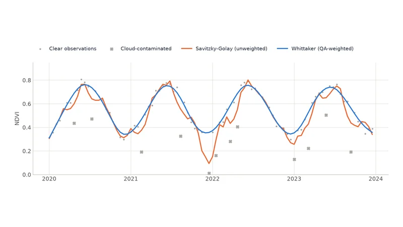

# User Guide

Step-by-step tutorials for every part of Zeit. Each one starts with what the method is for and a real output, explains how it works in plain language, then walks through the code and how to read the results.

!!! tip "New here?"
    Do the [Quickstart](../getting-started/quickstart.md) first, and skim [Core Concepts](../getting-started/concepts.md) for the conventions (array shapes, dates, scale factors) that every tutorial uses. Unsure which method fits your question? See [Choosing an Algorithm](../getting-started/choosing-an-algorithm.md).

## Change detection

Find where and when the land surface changed.

<a class="tile" href="landtrendr/">
  
  Annual dataLandTrendrDisturbance and recovery history from one image per year. Maps of year, magnitude and duration.
</a>

<a class="tile" href="ccdc/">
  
  Dense dataCCDCHarmonic models of every clear observation. Dates changes and describes the land before and after.
</a>

<a class="tile" href="bfast/">
  
  Regular seriesBFASTSeparate breaks in the trend from breaks in the seasonal cycle.
</a>

<a class="tile" href="bfast_monitor/">
  
  Near real timeBFAST MonitorTest new observations against a stable history. The basis of alert systems.
</a>

<a class="tile" href="bfast_lite/">
  
  Regular seriesBFAST LiteThe optimal number of breaks in a whole series, in a single fast pass.
</a>

## Time-series analysis

Trends, seasons, patterns and objects.

<a class="tile" href="mann_kendall/">
  
  TrendsMann-KendallSignificant greening and browning, with a robust slope per pixel.
</a>

<a class="tile" href="phenology/">
  
  SeasonsPhenologyStart, peak and end of every growing season, and 16 more metrics.
</a>

<a class="tile" href="twdtw/">
  
  ClassificationTWDTWMatch each pixel to reference patterns, tolerating shifts in timing.
</a>

<a class="tile" href="som/">
  
  ClusteringSOMFind the typical trajectories in a landscape without labels.
</a>

<a class="tile" href="snic/">
  
  SegmentationSNICGroup pixels with similar histories into fields and patches.
</a>

## Deep learning

PyTorch models for classification and change detection, weight-compatible with their reference implementations.

<a class="tile" href="tempcnn/">
  
  Pixel classificationTempCNNA fast 1-D convolutional baseline for pixel time series.
</a>

| Model | Task | Tutorial |
| :--- | :--- | :--- |
| Overview | Available models, data loading, loss functions | [Deep Learning](ai.md) |
| TempCNN | Pixel time-series classification (convolutional) | [TempCNN](tempcnn.md) |
| LTAE / LightTAE | Pixel time-series classification (attention) | [LTAE & LightTAE](ltae.md) |
| U-TAE | Segmentation of whole image patches over time | [UTAE](utae.md) |
| Siamese | Change detection between two dates | [Siamese Change Detector](siamese.md) |
| GeoFoundationViT | Fine-tuning pretrained foundation models | [GeoFoundationViT](geo_foundation_vit.md) |

## Getting and preparing data

<a class="tile" href="stac-downloads/">
  
  Cloud catalogsSTAC Data CubesLazy cubes from Earth Search, Planetary Computer or Brazil Data Cube; compositing and smoothing.
</a>

<a class="tile" href="tmask/">
  
  Cloud maskingTmaskCatch the clouds and shadows that single-image masks miss.
</a>

- **[Plotting & Exploring Results](plotting.md)**: `zeit.plot` for maps, dense time series and pixel fits, in a notebook or a window.
- **[Google Earth Engine](gee-downloads.md)**: harmonised Landsat composites prepared on Google's servers.
- **[Embeddings (TESSERA, AlphaEarth)](embeddings.md)**: the yearly embeddings of foundation models as a cube: classify from few samples, find similar places, follow change year to year.
- **[Parallel & Cloud Processing](parallel-cloud-processing.md)**: from one core to a cluster, with Dask and Zarr.
