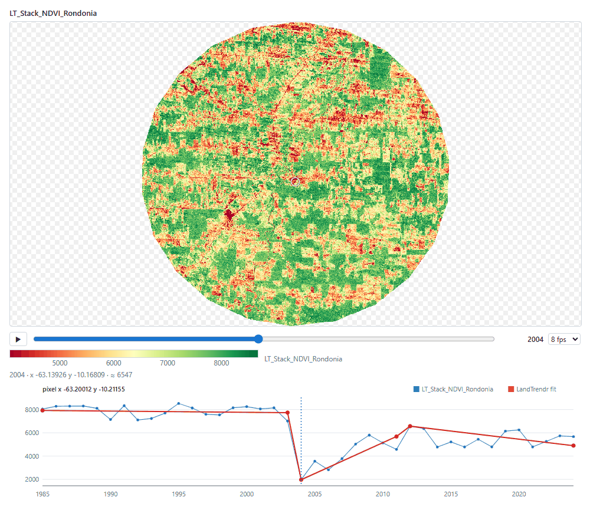
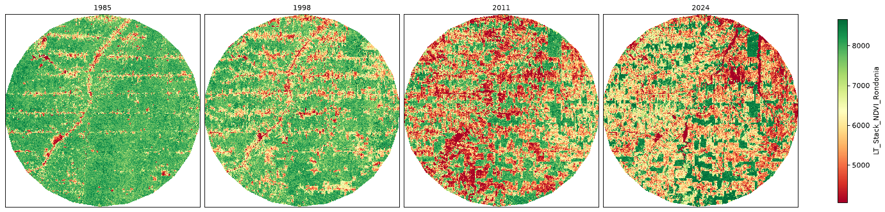
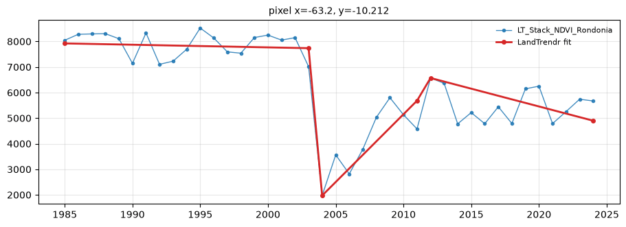
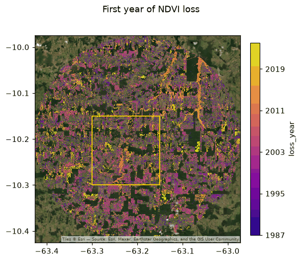

# Plotting and Exploring Results

<p class="lead">Look at a 40-year stack, page through it year by year, click a pixel to see its history and what LandTrendr made of it, and put the result on a satellite image, with one function: <code>zeit.plot</code>.</p>

<div class="glance" markdown>
<div><span class="k">Answers</span><span class="v">What does my data look like? Did the algorithm get this pixel right?</span></div>
<div><span class="k">Input</span><span class="v">Anything Zeit reads or returns: a cube, a map, a result <code>Dataset</code>, a pixel's series</span></div>
<div><span class="k">Output</span><span class="v">An interactive viewer (notebook or window) or a matplotlib figure</span></div>
<div><span class="k">Install</span><span class="v"><code>pip install zeit-cdts[plot]</code></span></div>
</div>

<figure markdown>
  
  <figcaption><strong>The viewer.</strong> 40 years of Landsat NDVI over Rondônia, Brazil, at 2004, the year this pixel was cleared. Below the map: the colour bar, the value under the cursor, and the clicked pixel's series with LandTrendr's segments (red), which also show the regrowth after the clearing. All 40 frames were in the browser 0.6 s after the page opened. <em>Data: annual Landsat NDVI composites exported from <a href="https://github.com/eMapR/LT-GEE">LT-GEE</a> on Google Earth Engine.</em></figcaption>
</figure>

## Why a viewer of its own

Dense time series are hard to look at with the usual tools. A matplotlib figure redraws every frame in Python (about 8 frames per second in a notebook), and a GPU widget that renders on the kernel still makes one round trip per frame. `zeit.plot` sends each frame to the browser **once**, as one byte per cell, and the browser's GPU colours it through a lookup table. After that, paging through time does not involve Python at all. It runs at the display's refresh rate (144 frames per second in our tests), and keeps working while another cell runs.

The cube is never read at full resolution as a whole: frames are read at about 800 cells on the longest side (the 40-year stack below is 12.5 MB at that size, loaded in a fraction of a second), and the viewer fetches finer cells only for the window you zoom into. On a dense lazy cube (240 dates of 2048 × 2048 cells in Zarr), the first frame shows in about a second and all 240 dates are in the browser within 9 seconds.

## Step by step

### 1. Install and load

```bash
pip install zeit-cdts[plot]      # matplotlib and anywidget; add pywebview for a native window
```

```python
import zeit

ndvi = zeit.load_raster("LT_Stack_NDVI_Rondonia.tif")
print(ndvi.dims, ndvi.shape)     # ('time', 'y', 'x') (40, 1671, 1686), years 1985-2024
```

This is the same stack as in the [LandTrendr tutorial](landtrendr.md): annual NDVI × 10,000 in Int16, EPSG:4326. `load_raster` names the cube after the file (`LT_Stack_NDVI_Rondonia`), which matters below: the name tells `zeit.plot` this is a vegetation index.

### 2. A grid of years

A static figure is the quickest look, and what goes into a report:

```python
zeit.plot(ndvi, time=["1985", "1998", "2011", "2024"], static=True)
```

<figure markdown>
  
  <figcaption>Four years of the stack. The colours were chosen from the data: a green-high palette because the name contains NDVI, limits at the 2nd and 98th percentiles of a sample, and the circle's outside (0, the stack's fill value) transparent.</figcaption>
</figure>

Nothing was configured. `zeit.plot` saw a vegetation index and used `RdYlGn` (green is high NDVI), set the colour limits from a sample instead of the whole cube, and treated `0` in this integer stack as NoData, as Earth Engine exports mean it. Every choice can be overridden:

```python
zeit.plot(ndvi, time="2024", cmap="viridis", vmin=3000, vmax=9000, static=True)
```

`time=` takes labels (`"2015"`), years (`2015`), dates (the nearest frame), indices (`0`, `-1`), a list of these, or `"all"`. Without it a static plot shows up to 12 frames spread over the series.

### 3. Page through time

In a notebook (JupyterLab, Notebook 7, VS Code or Colab), leave `static=` out:

```python
zeit.plot(ndvi)
```

The cell's output is the viewer: the first frame appears at once, and the rest arrive in the background, from the current frame outwards (the bar under the map shows the progress). Then:

| To | Do |
| :--- | :--- |
| Play or pause | Space, or ▶. The selector next to the slider sets the speed (1 to 60 fps). |
| Step | ← and →, Home and End, or drag the slider |
| Pan, zoom, reset | Drag, mouse wheel, double-click. Paused and zoomed in, the visible window is fetched again at a finer resolution. |
| Read a value | Hover: the year, the coordinates and the NDVI under the cursor appear below the map |

Click the viewer first so that it gets the keyboard. The value under the cursor is read back from the colour index, so it is approximate (`≈`, within 1/254 of the colour range).

### 4. Run LandTrendr and click a pixel

Calibrating a change-detection algorithm means looking at many pixels: is this vertex where the forest was cleared? Did it miss the regrowth? Pass the result as `fit=`, then click a pixel:

```python
lt = zeit.landtrendr(ndvi)        # a few seconds for the 2.8 million pixels
zeit.plot(ndvi, fit=lt)
```

The pixel's full series appears below the map, with LandTrendr's segments and vertices over it (the figure at the top of this page). A dotted line marks the frame shown, and clicking the chart jumps to that year, so you can go from a break in the series to the map on that date and back. The result is matched to the cube by coordinates, so a `fit` computed on a crop works too: pixels outside it just have no overlay.

Other results work the same way:

| `fit=` | What you see on the pixel's series |
| :--- | :--- |
| `zeit.landtrendr(ndvi)` | The segments, with the vertices |
| `zeit.extract_events(lt)` | The event kept for the pixel, as a shaded span |
| `zeit.ccdc(cube)` | The harmonic model of each segment and its break |
| `zeit.bfast_monitor(cube, ...)` | The break, and where monitoring starts |
| `zeit.bfast_lite(cube)`, `zeit.bfast(cube)` | The breaks |
| `zeit.mann_kendall(ndvi)` | The Theil-Sen trend line |

For a report, ask for one pixel as a figure: `pixel=` takes `(x, y)` in the data's coordinates, here longitude and latitude:

```python
zeit.plot(ndvi, fit=lt, pixel=(-63.2001, -10.2116), static=True, figsize=(9, 3.2))
```

<figure markdown>
  
  <figcaption>The pixel from the top of the page. Forest until 2003, cleared in 2004, regrowth until 2012, then a slow decline. LandTrendr placed a vertex at each of these turns.</figcaption>
</figure>

### 5. A loss-year map over satellite imagery

Results are `Dataset`s, and `zeit.plot` shows them like any other data. `zeit.plot(loss)` opens the viewer with a selector for `yod`, `magnitude`, `duration`… Here we keep the confident events, as in the LandTrendr tutorial, and put the year of loss on a satellite basemap with an area of interest outlined:

```python
from shapely.geometry import box

loss = zeit.extract_events(lt, min_magnitude=2000)
confident = (loss.yod > 1985) & (loss.dsnr >= 3)
loss_year = (loss.yod + 1).where(confident, 0).astype("uint16").rename("loss_year")

aoi = box(-63.30, -10.30, -63.15, -10.15)          # or a file: vector="aoi.gpkg"
zeit.plot(loss_year, basemap="satellite", vector=aoi, title="First year of NDVI loss")
```

<figure markdown>
  
  <figcaption>The static version of the same call (<code>static=True</code>). <code>loss_year</code> is a year map, so it gets a sequential palette with whole years on the colour bar; pixels without an event (0) are transparent, so the imagery shows through.</figcaption>
</figure>

A few things happened on their own:

- **Years.** A map named like `yod`, `year` or `*_year`, or with integers between 1800 and 2200, is coloured as years.
- **No event, no colour.** `0` is NoData for an integer map without one (`nodata="auto"`), so only the events are drawn.
- **Any CRS.** The data stays in its own CRS. The viewer places the web map's tiles under it without reprojecting the frames; a static plot downloads the tiles (cached in `~/.cache/zeit/tiles`) and warps them to the data's CRS.
- **Opacity.** Over a basemap the data is drawn at 80 % opacity; `opacity=` changes it, and the viewer has a slider.

`basemap=` also takes `"osm"`, `"light"` and `"dark"` (grey canvases), `"topo"`, an [xyzservices](https://xyzservices.readthedocs.io/) provider or name, or any `{z}/{x}/{y}` URL. `vector=` takes a vector file, a GeoDataFrame, a shapely geometry or a list of them, reprojected to the data's CRS; `vector_color=` sets their colour.

### 6. Save a figure

`save=` writes the figure (PNG, PDF, SVG… at 150 dpi) and returns it:

```python
zeit.plot(loss_year, basemap="satellite", vector=aoi, save="loss_year.png")
zeit.plot(ndvi, time="all", ncols=8, save="ndvi_1985_2024.pdf")
```

`save=` implies a static plot. For full control, the figure is an ordinary matplotlib `Figure`, and `ax=` draws a map into your own layout:

```python
import matplotlib.pyplot as plt

fig, (a, b) = plt.subplots(1, 2, figsize=(10, 4))
zeit.plot(ndvi, time="1985", ax=a, static=True)
zeit.plot(ndvi, time="2024", ax=b, static=True)
fig.savefig("before_after.png", dpi=200)
```

### 7. Outside the notebook

The same call works in a script or a terminal. There, `zeit.plot` opens the viewer in its own window: a native window if `pywebview` is installed, otherwise a browser tab.

```python
# look.py
import zeit

ndvi = zeit.load_raster("LT_Stack_NDVI_Rondonia.tif")
lt = zeit.landtrendr(ndvi)
zeit.plot(ndvi, fit=lt)      # opens a window; the script waits until you close it
print("done")
```

`python look.py` blocks on `zeit.plot` until the window is closed, like `plt.show()`. In an interactive interpreter (`python -i`, IPython in a terminal) the call returns a `Window` at once and the window stays up, so you can keep working:

```python
>>> w = zeit.plot(ndvi)
>>> w.url                    # the page, if you want to open it in another browser
'http://127.0.0.1:52113/Qm3n.../'
>>> w.close()
```

The page is served from 127.0.0.1 under a random token, so other users of the machine and other web pages cannot read the data. Where there is no screen (a server without a display, CI, tests) `zeit.plot` returns a figure instead, and `ZEIT_PLOT=static` in the environment does the same anywhere outside a notebook.

## Tips

- **Large cubes.** The viewer reads frames at about 800 cells on the longest side (`max_size=`) and keeps up to about 400 MB of them in the browser, so a cube larger than memory is fine, especially a lazy one (`load_raster(..., chunks="auto")`). Each frame is read when needed.
- **Remote notebooks** (JupyterHub, Colab). The preload is one transfer, compressed by default (`compress=True`); after it, playback uses neither the network nor the kernel.
- **Other dimensions.** Every dimension other than `y` and `x` is a frame axis: `zeit.plot(lt)` pages through LandTrendr's vertices, `zeit.plot(ccdc_result, var="coefs")` through CCDC's segments, bands and coefficients (labelled `1_blue_a0`, …).
- **Categories.** Integer maps with at most 32 values (classes, `n_vertices`) get one colour per value and a legend. Name them with `classes={1: "forest", 2: ("pasture", "#e8c170")}`.
- **One pixel's series.** A 1-D `DataArray` or `pandas.Series` is plotted as a line: `zeit.plot(ndvi.sel(x=-63.2, y=-10.21, method="nearest"))`.

See the [API reference](../api/plot.md#plot) for every parameter and the full colour rules.
