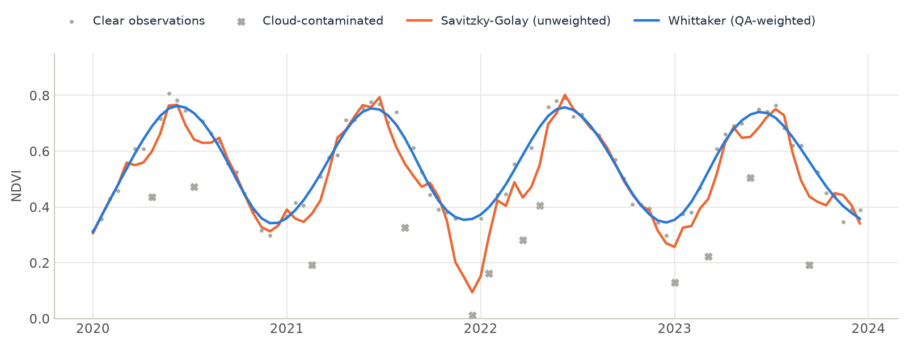

# STAC Data Cubes

<p class="lead">Build an analysis-ready data cube straight from a cloud catalog. You give an area, dates and bands, and get back a lazy xarray cube: nothing is downloaded until you compute, and then only the pixels you need are read.</p>

<div class="glance" markdown>
<div><span class="k">Does</span><span class="v">Search a STAC catalog, mask clouds, and stack the images into a cube</span></div>
<div><span class="k">Sources</span><span class="v">Earth Search (AWS), Planetary Computer, Brazil Data Cube, any STAC API</span></div>
<div><span class="k">Output</span><span class="v">A Dask-backed <code>xarray.DataArray</code> shaped <code>(time, band, y, x)</code></span></div>
<div><span class="k">Next</span><span class="v">Composite, smooth, and feed any algorithm</span></div>
</div>

[STAC](https://stacspec.org) (SpatioTemporal Asset Catalog) is the standard way cloud providers publish satellite imagery. Zeit searches a catalog, keeps the images that match your query, and assembles them with `stackstac` into one aligned cube.

## 1. Query a catalog

Select the area with a bounding box, a vector file (`vector_path`), or tile IDs: MGRS for Sentinel-2, WRS-2 path/row for Landsat.

```python
import zeit

# Option A: Bounding Box
cube = zeit.build_time_series(
    source="earth_search",
    collection="sentinel-2-l2a",
    bbox=[-48.5, -22.5, -48.0, -22.0],
    start_date="2022-01-01",
    end_date="2022-12-31",
    bands=["red", "green", "blue", "nir"]
)

# Option B: MGRS Tiles (Sentinel-2)
cube_tiles_s2 = zeit.build_time_series(
    source="earth_search",
    collection="sentinel-2-l2a",
    tiles=["22JFQ", "22JGQ"], # Fetch specific Sentinel-2 MGRS tiles
    start_date="2022-01-01",
    end_date="2022-12-31",
    bands=["red", "green", "blue", "nir"]
)

# Option C: WRS-2 Path/Row Tiles (Landsat)
cube_tiles_l8 = zeit.build_time_series(
    source="earth_search",
    collection="landsat-c2-l2",
    tiles=["215065"], # 6-digit Path/Row string (Path 215, Row 065)
    start_date="2022-01-01",
    end_date="2022-12-31",
    bands=["red", "green", "blue", "nir"]
)
```

## 2. Mask clouds

Zeit can automatically identify the satellite platform (Sentinel-2, Landsat) and apply semantic cloud masking natively before returning the cube. Just pass `apply_cloud_mask=True`. 
This will automatically download the respective Quality Assurance (QA) band (like `scl` for Sentinel) and mask out clouds, shadows, and cirrus.

```python
cube_clean = zeit.build_time_series(
    source="earth_search",
    collection="sentinel-2-l2a",
    tiles=["22JFQ"],
    start_date="2022-01-01",
    end_date="2022-12-31",
    bands=["red", "green", "blue", "nir"],
    apply_cloud_mask=True # Clouds are masked out!
)
```

## 3. Other sensors (MODIS and Sentinel-1)

`build_time_series` is not hardcoded to Sentinel-2/Landsat — it talks to any STAC API, so switching `source`/`collection`/`bands` is enough to pull other sensors from a catalog that hosts them. Microsoft Planetary Computer is the most complete public option for MODIS and Sentinel-1.

**Caveat:** `apply_cloud_mask=True` only knows how to decode Sentinel-2's `scl` and Landsat's `qa_pixel` bands (see `zeit/cube.py`). For MODIS and Sentinel-1, leave `apply_cloud_mask=False` and handle QA/no cloud-masking as shown below.

**MODIS (vegetation indices, 250m/16-day)**

```python
import zeit
from zeit.qc import qc_modis_summary

cube_modis = zeit.build_time_series(
    source="planetary_computer",
    collection="modis-13Q1-061",  # NDVI/EVI 250m, 16-day composites (modis-09A1-061 for 500m/8-day surface reflectance)
    bbox=[-52.10, -12.55, -51.95, -12.40],
    start_date="2010-01-01",
    end_date="2023-12-31",
    bands=["250m_16_days_NDVI", "250m_16_days_pixel_reliability"],
    apply_cloud_mask=False,  # not recognized for MODIS - masked manually below
)

ndvi = cube_modis.sel(band="250m_16_days_NDVI") * 0.0001  # apply the collection's scale factor
qa = cube_modis.sel(band="250m_16_days_pixel_reliability")

# 0=good, 1=marginal, 2=snow/ice, 3=cloudy -> [1.0, 0.5, 0.2, 0.2]
weights = qc_modis_summary(qa)
```

For 500m 8-day surface reflectance (`modis-09A1-061`), decode the `sur_refl_state_500m` QA band with `zeit.qc.qc_modis_state` instead.

**Sentinel-1 SAR (radar, no clouds)**

```python
cube_s1 = zeit.build_time_series(
    source="planetary_computer",
    collection="sentinel-1-rtc",  # radiometrically terrain-corrected, analysis-ready (prefer this over the raw "sentinel-1-grd" unless you plan to do RTC yourself)
    bbox=[-52.10, -12.55, -51.95, -12.40],
    start_date="2020-01-01",
    end_date="2023-12-31",
    bands=["vv", "vh"],
    resolution=10,
    apply_cloud_mask=False,  # SAR is unaffected by clouds - never pass apply_cloud_mask=True here
)
```

Radar backscatter is dense (Sentinel-1 revisits every 6-12 days regardless of cloud cover), which makes it a strong complement to optical CCDC/LandTrendr/Mann-Kendall runs in persistently cloudy regions. Check the actual pixel value range before feeding it downstream — RTC gamma-naught can come back as either dB or linear power depending on the processing pipeline, and that changes how you interpret slope/magnitude.

Neither `earth_search` nor `brazil_data_cube` currently expose MODIS or Sentinel-1 collections, so `planetary_computer` is the practical default for both. `source` also accepts any custom STAC API URL (e.g. a national or provider-specific SAR catalog) if you need one outside the three built-in aliases.

**Landsat and Sentinel-2 in one series**

Two collections on the same grid (the same `bbox`, `resolution` and `epsg`) become one denser series with [`zeit.harmonize`](../api/preprocessing.md#harmonize), which takes each Sentinel-2 date to Landsat 8's reflectance scale (the HLS bandpass adjustment of its unit) and matches the bands by role, whatever each catalog calls them:

```python
grid = dict(source="planetary_computer", bbox=[-52.10, -12.55, -51.95, -12.40], start_date="2019-01-01",
            end_date="2024-12-31", apply_cloud_mask=True, resolution=30, epsg=32722)
s2 = zeit.build_time_series(collection="sentinel-2-l2a", bands=["B02", "B03", "B04", "B8A", "B11", "B12"], **grid)
landsat = zeit.build_time_series(collection="landsat-c2-l2",
                                 bands=["blue", "green", "red", "nir08", "swir16", "swir22"], **grid)
mixed = zeit.harmonize([s2, landsat])   # (time, band, y, x): blue, green, red, nir, swir1, swir2
```

Load Sentinel-2's narrow NIR (B8A, `nir08` on Earth Search): it is the band HLS adjusts to Landsat's. The adjustment is only part of what separates the two sensors; the [reference](../api/preprocessing.md#harmonize) shows what remains on a stable site.

## 4. Composite to a regular time step

Raw STAC data usually comes in irregular time steps (e.g., passing every 5, 8, or 12 days). For advanced Machine Learning and TWDTW, you must regularize the cube to fixed temporal steps.

You can use `zeit.regularize_time_series` to composite these observations into regular windows (e.g., 16-day composites) using multi-dimensional `medoid` or `median` strategies. Because it uses `xarray`, this computation remains fully lazy!

```python
from zeit import regularize_time_series

# Create a 16-day Medoid composite
cube_16d = regularize_time_series(cube_clean, freq="16D", method="medoid")

# The output has regular 16-day steps on the 'time' dimension
print(cube_16d.time)
```

### Annual composites for LandTrendr

LandTrendr needs one cloud-free value per pixel per year. `zeit.build_annual_composites` builds that stack directly: one masked median (or medoid) of a seasonal window per year, as reflectance, with the years without scenes left as NaN so the time axis has no gaps.

```python
comp = zeit.build_annual_composites(
    source="planetary_computer",
    collection="landsat-c2-l2",
    bbox=[9.63, 50.92, 12.06, 52.43],   # one 150 km tile
    start_year=1985,
    end_year=2024,
    season=("06-01", "09-30"),
    bands=["nir08", "swir22"],          # only what NBR needs
    epsg=3035,
)
nbr = (comp.sel(band="nir08") - comp.sel(band="swir22")) / (comp.sel(band="nir08") + comp.sel(band="swir22"))
zeit.save_raster(nbr, "nbr_1985_2024.tif")
```

It reads the scenes as raw integers and reduces each spatial chunk as soon as all of its scenes have arrived, so memory stays bounded however many scenes a year has (in our test, a lazy `cube.median("time")` over a 150 km tile with 100 scenes exhausted 68 GB of RAM). See [STAC download throughput](../benchmarks/performance.md#stac-download-throughput-landsat-annual-composites) for timings.

!!! tip "Download speed"
    - **Read only what you need.** Download time grows with scenes × bands: each extra band adds about a third for an NBR stack (2 bands + QA).
    - **Pick the provider close to you.** The same Landsat Collection 2 files are on Planetary Computer (Azure West Europe, free) and on Earth Search (AWS us-west-2, requester-pays bucket: needs AWS credentials and the requester pays about US$ 0.09/GB leaving AWS). Latency matters as much as bandwidth for COG range reads.
    - **Run next to the data for many tiles.** From a VM in the provider's region, transfer is free and bandwidth is 10–100× a typical office link.
    - **Don't push the thread count.** The defaults (2048 px chunks, Dask's default threads) are already close to a 200 Mbit/s link's limit. Well beyond about 64 threads in one process, GDAL can deadlock inside its HTTP layer.

## 5. Compute spectral indices

STAC catalogs serve files, not computations, so the bands an index needs always travel over the network: NDVI needs `red` and `nir`. What `zeit` avoids is *storing* them. The cube is lazy, so the index is computed chunk by chunk as the bands arrive, and only the index is written to disk.

**The index is pre-calculated by the provider.** Some catalogs (such as Brazil Data Cube) serve an `ndvi` asset, or MODIS vegetation indices (`modis-13Q1-061` on Planetary Computer). Load it like any band:
```python
cube_ndvi = zeit.build_time_series(
    source="brazil_data_cube",
    collection="CBERS4A_WFI_L4_SR",
    tiles=["022024"],
    bands=["ndvi"],
)
```

**Compute it from reflectance.** `zeit.compute_indices` finds each band role by its usual asset names (`red` / `B04`, `nir08` / `nir` / `B08`...), so the same call works for Landsat and Sentinel-2 on every built-in catalog. Available: `NDVI`, `EVI`, `SAVI`, `kNDVI`, `NBR`, `NDMI`, `NDWI`, `MNDWI`, and `NDFI` (Landsat: it unmixes the six reflective bands).
```python
cube_raw = zeit.build_time_series(
    source="planetary_computer",
    collection="sentinel-2-l2a",
    tiles=["22JFQ"],
    bands=["B02", "B04", "B08", "B12"],   # only what the indices need
    apply_cloud_mask=True,
)
idx = zeit.compute_indices(cube_raw, ["NDVI", "EVI", "NBR"])   # (time, 3, y, x), still lazy
```

### Spectral temporal metrics

Spectral temporal metrics (STMs) summarize a season per pixel: the median, percentiles and spread of each index over every clear observation. They are a compact, gap-free input for land cover classification. `zeit.build_spectral_temporal_metrics` builds them per year without ever holding the observations: each spatial chunk is read once as raw integers, masked, turned into indices observation by observation, and reduced to the metrics.

```python
stm = zeit.build_spectral_temporal_metrics(
    source="planetary_computer",
    collection="landsat-c2-l2",
    bbox=[-47.95, -15.85, -47.90, -15.80],
    start_year=2015,
    end_year=2024,
    season=("05-01", "09-30"),                # dry season
    indices=["NDVI", "NBR", "swir1"],          # indices, band roles or asset names
    metrics=["median", "p10", "p90", "iqr", "count"],
    epsg=32723,
)
# (time=10, band=15, y, x): NDVI_median, NDVI_p10, ..., swir1_count
zeit.save_raster(stm.sel(year=2024), "stm_2024.tif")
```

The index is computed on every observation before the statistics, so `NDVI_median` is the median NDVI, not the NDVI of the median bands. Band names and order match the Earth Engine version (`download_gee_timeseries(composite_type="stm")`).

## 6. Smooth noisy series

Even after masking and compositing, some cloud-affected values remain. `zeit.smooth` smooths a cube along `time`, keeping its dates and georeferencing:

<figure markdown>
  
  <figcaption>Savitzky-Golay follows the cloud drops because it treats every point equally. The Whittaker smoother, given weights of 0 for the cloudy observations, ignores them and recovers the seasonal curve.</figcaption>
</figure>

```python
smooth_sg = zeit.smooth(ndvi, method="savgol", window=7, polyorder=2)

weights = clear.astype(float)             # 1 = clear, 0 = cloudy, or QA weights from zeit.qc
smooth_wh = zeit.smooth(ndvi, lmbda=10, weights=weights)
```

`lmbda` sets the smoothness of the Whittaker smoother: larger values give a stiffer curve. It takes unevenly spaced dates as they are, and observations that are NaN (masked clouds) weigh 0, so the curve fills them. For per-observation weights from a QA band, see `zeit.qc` (`qc_sentinel2_scl`, `qc_modis_summary`, `qc_modis_state`). `zeit.plot(ndvi, fit=smooth_wh)` draws the curve over any pixel you click.

## Local GeoTIFFs instead of a catalog

Already have the files on disk? `load_raster` builds the same kind of lazy cube from a folder, parsing dates and bands from the file names.

```python
import zeit

# Files like "SENTINEL_20220101_B02.tif": the regex captures (?P<date>...) and (?P<band>...)
cube_local = zeit.load_raster(
    "/path/to/my/tiffs",
    pattern=r"_(?P<date>\d{8})_(?P<band>B\d{2})\.tif$",
    date_format="%Y%m%d",
    recursive=True,
    chunks="auto",
)   # (time, band, y, x), lazy

# Scenes on different grids (two UTM zones, two orbits): put them on one as they are read
cube_local = zeit.load_raster("/path/to/my/tiffs", pattern=..., like="reference.tif", chunks="auto")
```

## Next steps

The cube is ready for any analysis. Common next steps:

- one value per year for [LandTrendr](landtrendr.md) or [Mann-Kendall](mann_kendall.md): [`build_annual_composites`](#annual-composites-for-landtrendr);
- regular 16-day composites for [BFAST](bfast_monitor.md), [phenology](phenology.md) and [TWDTW](twdtw.md);
- every clear image, multi-band, for [CCDC](ccdc.md).
