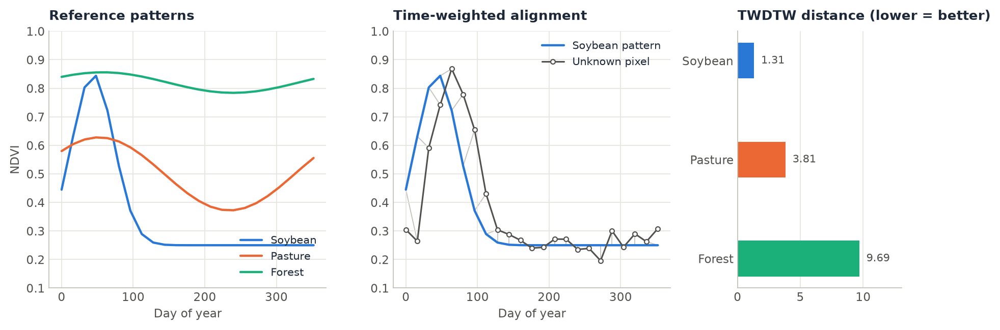

# Pattern Matching (TWDTW)

<p class="lead">Classify pixels by comparing their time series with a few reference patterns, one per class. Time-Weighted Dynamic Time Warping lets a pattern stretch and shift to match a pixel (a crop planted three weeks late is still that crop) while penalising shifts that would be implausible.</p>

<div class="glance" markdown>
<div><span class="k">Answers</span><span class="v">Which known temporal pattern does this pixel look like?</span></div>
<div><span class="k">Input</span><span class="v">A cube (or a pixel's series) and one reference series per class, with dates</span></div>
<div><span class="k">Output</span><span class="v">A class map and a distance (match quality) map</span></div>
<div><span class="k">Reference</span><span class="v">Maus et al. (2016)</span></div>
</div>

<figure markdown>
  
  <figcaption><strong>What TWDTW does.</strong> Left: reference NDVI patterns for three classes. Middle: a soybean field planted about three weeks later than the reference; the grey lines show how TWDTW aligns each observation to the pattern despite the shift. Right: distances to each class. The pixel is correctly labelled soybean (lowest distance).</figcaption>
</figure>

## How it works

Plain distances compare observation 1 with observation 1, 2 with 2, and so on, so a small shift in timing looks like a big difference. **Dynamic Time Warping** finds the best alignment between two series instead, allowing one to be locally stretched or compressed. The **time-weighted** version (TWDTW) adds a cost that grows with the time $\Delta t$ (in days) between matched observations, following a logistic curve:

$$
w(\Delta t) = \frac{1}{1 + e^{-\text{steepness}\,(\Delta t - \text{midpoint})}}
$$

Small seasonal shifts are cheap; implausible ones (matching a January peak to a July peak) cost up to one unit more per pair. With `cycle="year"` (the default) $\Delta t$ is measured between days of the year, around the year, so a pattern built from one year matches the same season of any other year, and 31 December is a day away from 1 January. Each pattern may match any stretch of a pixel's series, which can be longer than the pattern (several seasons, several years).

`zeit.twdtw` computes the distance of the R package [twdtw](https://cran.r-project.org/package=twdtw) (Maus et al.), checked against it to 1e-12, in C++ with OpenMP across pixels and a two-row dynamic program that stays in the CPU cache. Dates a pixel has no value for (clouds, NoData) are left out of its series.

## Step by step

### 1. Define reference patterns

A pattern is a typical series of a class: a `pandas.Series` indexed by dates (or a `DataFrame` with one column per band). Patterns usually come from the average of a few labelled samples per class.

```python
import numpy as np
import pandas as pd
import zeit

dates = pd.date_range("2021-01-01", "2021-12-31", freq="16D")   # a 16-day series over one year
t = (dates.dayofyear.to_numpy() - 1) / 365

patterns = {
    "Soybean": pd.Series(0.25 + 0.60 * np.exp(-0.5 * ((t - 0.12) / 0.08) ** 2), dates),
    "Pasture": pd.Series(0.50 + 0.08 * np.cos(2 * np.pi * t) + 0.10 * np.sin(2 * np.pi * t), dates),
    "Forest":  pd.Series(0.82 + 0.02 * np.cos(2 * np.pi * t) + 0.03 * np.sin(2 * np.pi * t), dates),
}
```

### 2. Compare one pixel

```python
pixel = ...   # a pandas Series of NDVI indexed by dates
result = zeit.twdtw(pixel, patterns)
dict(zip(result.pattern.values, result.distances.values.round(2)))
# {'Soybean': 1.31, 'Pasture': 3.81, 'Forest': 9.69}
result.label.item()     # 1: Soybean, the first pattern
```

These are the distances in the figure above (a soybean field planted about three weeks later than the pattern).

### 3. Classify a whole cube

The same call on a cube `(time, y, x)` matches every pattern against every pixel in parallel:

```python
ndvi = zeit.load_raster("S2_ndvi_2021.tif")          # (time, y, x), dates from the file
classes = zeit.twdtw(ndvi, patterns)

classes.label            # (y, x): 1 Soybean, 2 Pasture, 3 Forest (0: no observation)
classes.distance         # (y, x): distance to the winning pattern
classes.distances        # (pattern, y, x): distance to every pattern
classes.label.zeit.plot(basemap="satellite")          # the legend names the classes
zeit.save_raster(classes, "twdtw")                    # label.tif, distance.tif, distances.tif
```

`distance` is the TWDTW distance to the winning class. High values mean no pattern fits well, which usually deserves a separate "unknown" label:

```python
known = classes.label.where(classes.distance <= classes.distance.quantile(0.95), 0)
```

To see why a pixel got its class, plot the cube with the result: clicking a pixel draws its series with the winning pattern aligned over it.

```python
zeit.plot(ndvi, fit=classes)
```

A raster larger than memory stays lazy with `zeit.twdtw("ndvi.tif", patterns, chunks="auto")`, computed block by block while `save_raster` writes it.

### Several bands at once

Give the patterns one column per band, named as the cube's bands; the cube `(time, band, y, x)` is matched on those bands together (Euclidean distance across bands):

```python
patterns = {"Soybean": pd.DataFrame({"ndvi": soy_ndvi, "swir1": soy_swir1}), ...}
classes = zeit.twdtw(cube, patterns)                  # uses cube.sel(band=["ndvi", "swir1"])
```

With one-band patterns and a multi-band cube, choose the band: `zeit.twdtw(cube, patterns, band="ndvi")`.

## Parameters

| Parameter | Default | Effect |
| :--- | :---: | :--- |
| `steepness` | `0.1` | Steepness of the logistic time weight, per day. Higher values make the cost jump more sharply around `midpoint`. |
| `midpoint` | `50` | Days apart at which a matched pair costs half a unit more. Shifts much shorter than this are nearly free. |
| `cycle` | `"year"` | `"year"`: days of the year, around the year. `None`: the dates themselves (patterns and pixels from the same season). |
| `max_elapsed` | `None` | Pairs farther apart than this many days are never matched. |

Tune `midpoint` (and `steepness`, for how much timing matters against the index values) on a few labelled pixels before classifying a whole area. The defaults are R twdtw's `time_weight = c(0.1, 50)`.

## References

- Maus, V., Câmara, G., Cartaxo, R., Sanchez, A., Ramos, F. M., & de Queiroz, G. R. (2016). A time-weighted dynamic time warping method for land-use and land-cover mapping. *IEEE Journal of Selected Topics in Applied Earth Observations and Remote Sensing*, 9(8), 3729–3739. [doi:10.1109/JSTARS.2016.2517118](https://doi.org/10.1109/JSTARS.2016.2517118)
- Maus, V., Câmara, G., Appel, M., & Pebesma, E. (2019). dtwSat: Time-Weighted Dynamic Time Warping for Satellite Image Time Series Analysis in R. *Journal of Statistical Software*, 88(5), 1–31. [doi:10.18637/jss.v088.i05](https://doi.org/10.18637/jss.v088.i05)
